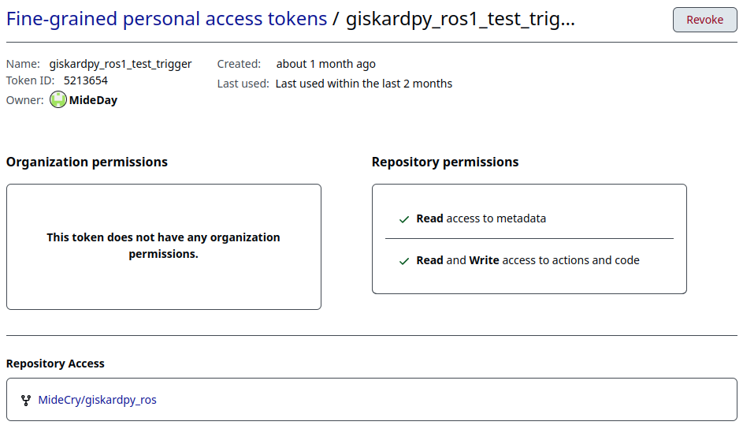
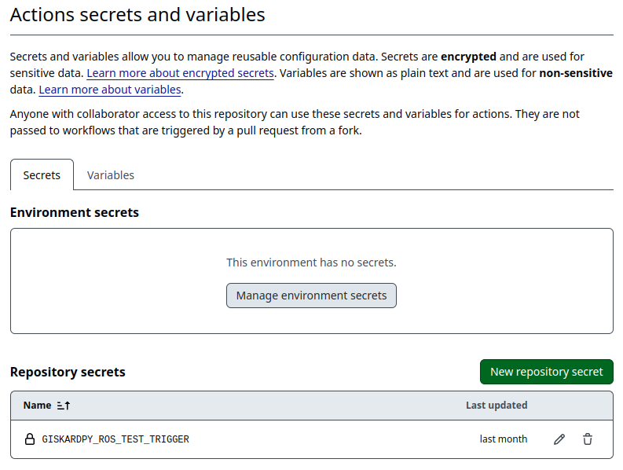

# Workflow descrption
## main_unit_tests.yml
Performs giskardpy-Tests using pre-built Dockerimages 
Tests are performed in parallel using both ubuntu20.04 and ubuntu 24.04.

## publish_dockerfiles.yml
Publishes the ubuntu20.04 and ubuntu24.04 docker images that are required for main_unit_tests.yml.

## trigger_giskardpy_ros_ci_standalone.yml
Triggers tests for giskardpy_ros on branch ros1_noetic_main when a pull-request is created.  
Requires:
- Repository giskardpy_ros on same user/organization as giskardpy
- Secret called giskardpy_ros_test_trigger with read and write access to actions and code in giskardpy

### Required access token
The fine-grained personal access token needs to be setup like the following image.
Token name is not important.

### Required repository secret
In Giskardpy-Repository under *Secrets and Variables* -> *Actions*.  
Create Repository secret with called giskardpy_ros_test_trigger with a fine-grained personal access token for giskardpy_ros.

